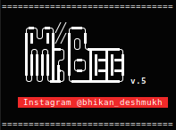

<p align="center"><a> </a>

-------------------------------------------------------------------------------------

# <p align="center">𝗠𝗥. 𝗕𝗘𝗘 𝗧𝗢𝗢𝗟 𝗣𝗔𝗖𝗞</p>

-------------------------------------------------------------------------------------

<p align="center">
	
</p>

-------------------------------------------------------------------------------------

<p align="center">
<a href="https://github.com/bhikandeshmukh"></a>
 <a href="https://github.com/bhikandeshmukh/Termux-Keys"></a>
 <a href="https://github.com/bhikandeshmukh"></a>
<a href="https://github.com/bhikandeshmukh/followers"></a>
<a href="https://github.com/bhikandeshmukh/MrBeePack/network/members"></a>
<a href="https://github.com/bhikandeshmukh/MrBeePack/watchers"></a>
</p>

-------------------------------------------------------------------------------------

###### <p align="center">*This is official repository maintained by us*
###### <p align="center"> *[**Mr. Bee**](https://www.instagram.com/bhikan_deshmukh/) ❤️*

-------------------------------------------------------------------------------------

### Introduction

* hacking tool recorded by Mr. Bee
15 hacking tools included.

-------------------------------------------------------------------------------------

### Operating System Requirements
• **Linux** (Any) <br>
• **MacOS** <br>
• **Android** (Using the Termux App {Hackers Keyboard Recommended}) <br>

-------------------------------------------------------------------------------------

### Usage : ( Linux, MacOS )
```
$ git clone https://github.com/bhikandeshmukh/MrBeePack.git
$ cd MrBeePack
$ chmod +x Mr.Bee.sh
$ ./Mr.Bee.sh
```
-------------------------------------------------------------------------------------

### Usage : ( Android {Termux, UserLand} )
```
$ apt install git
$ git clone https://github.com/bhikandeshmukh/MrBeePack.git
$ cd MrBeePack
$ chmod +x Termux-install.sh
$ ./Termux-install.sh
```

Run After Installing Termux-install.sh
```
$ chmod +x Mr.Bee,sh
$ ./Mr.Bee.sh
```
-------------------------------------------------------------------------------------

## Legal Disclaimer :

Usage of the tool for attacking targets without prior mutual consent is illegal. It's the end user's responsibility to obey all applicable local, state and federal laws. Developers assume no liability and are not responsible for any misuse or damage caused by this program

-------------------------------------------------------------------------------------

### Development by

Developer / Author: [Bhikan Deshmukh](https://www.instagram.com/bhikan_deshmukh/)

<h2 align="center">To Know about Ethical Hacking , Android And Kali Linux Do ♨️ Follow ♨️ Us:-</h2>
<p align="center">
<a href="https://www.instagram.com/bhikan_deshmukh/"></a>
<a href="https://wa.me/918600525401"></a>
<a href="https://www.facebook.com/thebhikandeshmukh"></a>
<a href="https://www.twitter.com/bhikan_deshmukh/"></a>
<a href="https://t.me/dev_aladdin"></a>
<a href="https://rzp.io/l/mrbee"></a>
</p>

-------------------------------------------------------------------------------------
